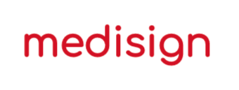

# Electronic Medical Record

Developed an accessible, voice-enabled electronic medical record system which stores patients’ medical records, allows patients to fill out medical forms using speech-to-text, and provide an electronic voice signature. Our theme while building it was accessibility, hence the voice control integration, simple and easy to understand UI, and big, bold colours.

This project was inspired by Leon's father's first-hand experience with a lack of electronic medical records and realizing the need for more accessible patient experience.

The Devpost can be found here: https://devpost.com/software/medisign

## How It Is Built

The front end is built on react-native, while the backend is built in node.js using MongoDB Atlas as our database. The backend was deployed on a Heroku instance also. For our speed to text processing, we used the Google Cloud Platform. We also used Twilio for our SMS reminder component.

## App Screenshots

Login screen and patient record form

 

List of patients in the database and possible actions to perform with a patient record

 

A demonstration video showing the text-to-speech functionality can be found here: https://youtu.be/CzdRG3rPEl0
